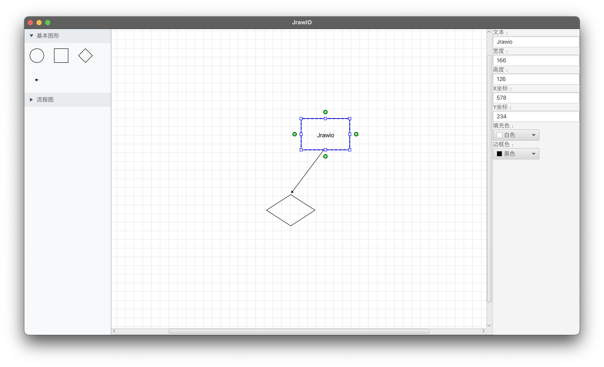

# 基于javafx构建的流程图绘制工具Jrawio

## 1. 项目概述

### 1.1 项目依赖

项目基于javafx开发， 使用gradle作为构建工具， 主要依赖和使用到的能力如下:

- **javafx** 功能略强于swing的GUI框架， 主要提供通过FXML进行布局的能力， 类似于HTML， 并支持CSS， 通过使用javafx将布局和实际业务逻辑解耦
- **lombak** 编译期生效，主要提供类似kotlin一样使用注解生成Getter， Setter方法的能力， 方便代码编写

### 1.2 功能实现情况

#### 基本图形支持 (15分)

- ✅ 创建图形：用户可以通过工具栏选择并在画布上创建矩形、菱形和椭圆形基础图形（可以自行添加更多图形）
- ✅ 编辑图形属性：允许用户修改图形的颜色和文字标签
- 图形库：提供一个图形库面板，用户可以从中选择常用的流程图元素组，如开始/结束流程组、输入/输出流程组等

#### 图形元素的交互 (15分)

- ✅ 界面互动：实现一个直观的拖放界面，用户可以直接从图形库中拖动图形到画布上
- ✅ 多选操作：用户可以通过框选或点击的方式选择多个图形，并统一进行移动或格式设置
- ✅ 快捷键支持：提供快捷键支持，如使用 Ctrl+C 和 Ctrl+V 进行复制粘贴操作
- 撤销和重做：
- 操作记录：系统应记录用户的所有操作，以便可以随时撤销或重做
- 撤销/重做栈：实现撤销和重做功能的栈，确保操作的正确性和顺序
- 自动对齐：拖放图形时，支持网格对齐或自动吸附功能，以便用户精确放置图形

#### 流程图的连接线 (10分)

- ✅ 自动连接点识别：当用户尝试连接两个图形时，系统应自动显示可用的连接点
- ✅ 连接线的自适应移动：当用户拖动两个连接好的图形时，连接线应该跟随图形移动
- 线型选择：
- 默认使用箭头作为连接线的样式
- 用户可以选择直线、折线或曲线等不同的连接线样式
- ✅ 线条编辑：支持线条的粗细、颜色修改，以及添加箭头或其他标记

#### 文件操作 (10分)

- 保存与加载：支持流程图的保存和加载，文件格式可以为自定义格式或通用格式如 XML
- ✅ 导出功能：允许用户将流程图导出为图片（如 PNG 或 JPEG 格式）或者 SVG 或者 PDF

#### 高级图形功能

- 图形分组：允许用户对选中的多个图形进行分组，作为单一对象进行操作
- 自定义图形属性：支持用户为图形添加自定义属性，如附加文本、链接或代码
- 配色方案：给用户提供配色方案的模版或者使用算法自动生成流程图元素的配色方案

### 1.3 项目界面概览



## 2. 项目结构说明

```shell
└── src
    └── main
        ├── java
        │   ├── module-info.java
        │   └── org
        │       └── jrawio
        │           ├── controller
        │           │   ├── components
        │           │   │   ├── CanvasContextMenu.java
        │           │   │   ├── CenterPanel.java
        │           │   │   ├── DragDataFormats.java
        │           │   │   ├── JrawioCanvas.java
        │           │   │   ├── LeftPanel.java
        │           │   │   ├── RightClickMenu.java
        │           │   │   ├── RightPanel.java
        │           │   │   ├── ShapeBar.java
        │           │   │   ├── ShapeButton.java
        │           │   │   └── ShapeClipboard.java
        │           │   └── shape
        │           │       ├── ArrowCreationManager.java
        │           │       ├── ArrowHandleManager.java
        │           │       ├── ArrowShape.java
        │           │       ├── BlockShape.java
        │           │       ├── DiamondShape.java
        │           │       ├── LineShape.java
        │           │       ├── OvalShape.java
        │           │       ├── RectangleShape.java
        │           │       ├── ResizeHandleManager.java
        │           │       ├── Shape.java
        │           │       ├── ShapeFactory.java
        │           │       ├── ShapeGeometryUtils.java
        │           │       └── ShapeType.java
        │           └── MainApp.java
        └── resources
            └── org
                └── jrawio
                    ├── components
                    │   ├── canvas_component.fxml
                    │   ├── shape_bar.fxml
                    │   └── shape_button.fxml
                    ├── layout
                    │   ├── center_panel.fxml
                    │   ├── left_panel.fxml
                    │   └── right_panel.fxml
                    ├── scene.fxml
                    └── styles.css
```

- resources 存放所有的布局文件和CSS， 用于页面布局和项目管理
- controller包 存放所有的业务控制逻辑
- components子包 界面控件相关的业务逻辑代码
- shape子包 绘图相关的所有控制代码

## 3. 主要功能实现思路

### 3.1 图形

所有流程图图形都使用Shape抽象骨架类表示， Shape类继承javafx.Canvas, 实际上是javafx组件， 可以被直接添加到javafx组件树中，
Shape类中完成了图形通用逻辑(绘制， 拖拽等)， 在BlockShape类和LineShape类继承Shape类， 同样是抽象类， 这一层中主要完成一类图形到特有逻辑， 比如缩放， 最终特定于某个图形的逻辑在特定图形的类中实现

```text
Shape (抽象基类)
├── BlockShape (抽象中间类)
│   ├── OvalShape (椭圆/圆形)
│   ├── RectangleShape (矩形)
│   └── DiamondShape (菱形)
└── LineShape (抽象中间类)
    └── ArrowShape (箭头)
```

#### 3.1.1 图形创建

图形创建包括两种形式， 直接创建和拷贝创建， 由ShapeFactory统一管理， ShapeFactory同时使用静态工厂模式和抽象工厂模式来满足不同的图形创建

- **静态工厂** 主要应对的是创建默认图形的场景，createShape方法接受一个形状类型枚举， 构造一个默认的图形返回

- **抽象工厂** 主要应对的是通过复制创建的场景，将各自的拷贝逻辑交给具体的类型负责，ShapeFactory通过createShapeByCopy方法调用类的copy方法， 得到类构造的自己的拷贝并返回

#### 3.1.2 图形选择

通过Shape类中的selected字段标识选中状态， 并且使用一个静态成员selectedShapes的Set存储所有被选中的类，setSelected方法用于切换状态并维护Set， 并暴露该方法供外部使用

- **框选** 框选的主要逻辑是通过鼠标拖动标识一片区域，然后遍历所有图形找到在范围内的图形， 并调用setSelected方法设置选中状态

- **多选** 普通的选择将遍历Set并清除所有选中状态然后选中Shape， 通过检查有没有按下的ctrl按键来移除这个限制

#### 3.1.3 图形拖动

主要通过鼠标事件，检查按下时的坐标和鼠标移动的坐标来更新图形位置，这里有一个问题是大量的操作都是拖动， 会触发相同的事件， 需要有办法得知当前触发的是什么事件， 为了解决这个问题引入Shape类内部的状态机， 用于区分事件和操作

- **状态机管理** Shape类内部包含一个ShapeStateMachine状态机，定义了四种互斥的交互状态：IDLE（空闲）、DRAGGING（拖动）、RESIZING（缩放）、CREATING_ARROW（创建箭头）。状态机负责管理当前操作状态和相关数据，如原始坐标、活动控制点等

- **模板方法模式** 拖动处理采用模板方法模式，Shape类提供统一的事件处理框架（handlePressed、handleDragged、handleMouseReleased），同时通过Hook方法让子类扩展特定功能。这样既保证了基础拖动逻辑的一致性，又允许不同类型图形有特殊处理

- **多选同步拖动** 当多个图形被选中时，拖动任意一个图形会同步移动所有选中的图形。通过遍历selectedShapes集合，计算偏移量并应用到每个选中图形，同时同步移动相关的文本框和连接线

#### 3.1.4 图形渲染与显示

图形的绘制采用Canvas绘制模式，每个Shape都继承自javafx.Canvas，拥有独立的GraphicsContext进行绘制

- **分层绘制** 每个图形的绘制分为多个层次：背景清理、图形主体绘制、选中状态绘制（蓝色虚线框和控制点）、文本绘制。通过draw()方法协调这些绘制步骤

- **几何计算工具** ShapeGeometryUtils类提供统一的几何计算服务，包括绘制区域计算、控制点位置计算、文本居中计算等。这样避免了重复的几何计算代码，提高了代码复用性

#### 3.1.5 图形属性管理

每个图形都支持多种属性的动态修改，属性变化会立即反映到视觉显示上

- **基础属性** 所有图形都支持文本内容、宽度、高度、位置坐标等基础属性。这些属性通过右侧面板的控件进行修改，修改后立即调用相应的setter方法更新图形

- **控件生成** Shape类提供getControlComponents()方法，动态生成对应的控制组件。基础控制组件包括文本输入框、尺寸输入框、位置输入框等，子类可以扩展添加特定的控制组件

- **实时更新** 属性修改会触发draw()方法重新绘制图形，同时通过onPositionChanged()和onSizeChanged()等Hook方法通知相关组件（如连接线）进行相应调整

### 3.2 连接线系统

连接线系统基于ArrowShape类实现，支持图形间的智能连接和动态更新

#### 3.2.1 箭头创建流程

箭头的创建采用多阶段流程，通过用户交互逐步完成连接

- **控制点激活** 用户点击BlockShape上的绿色箭头控制点时，进入箭头创建模式。状态机切换到CREATING_ARROW状态，记录起始图形和控制点位置

- **拖动预览** 拖动过程中显示临时箭头预览，箭头起点固定在源图形的连接点，终点跟随鼠标移动。ArrowCreationManager负责管理这个创建过程

- **目标检测** 拖动时实时检测鼠标下方是否有可连接的目标图形。如果检测到目标，会显示吸附效果并高亮显示可用的连接点

- **连接完成** 鼠标释放时，如果存在有效的目标图形，则创建正式的ArrowShape并添加到画布。连接信息会记录在源图形和目标图形中，用于后续的动态更新

#### 3.2.2 连接线跟随

当连接的图形移动或缩放时，连接线需要自动调整以保持正确的连接关系

- **连接点计算** 每个BlockShape提供calculateArrowConnectionPoint()方法，根据箭头控制点类型计算实际的连接点坐标。连接点位置会根据图形的当前尺寸和位置动态计算

- **自动更新** 当图形的位置或尺寸发生变化时，会调用onPositionChanged()或onSizeChanged()方法。这些方法会遍历所有相关的连接线，更新它们的端点坐标

- **连接关系管理** BlockShape维护connectedArrows列表，记录所有连接到该图形的箭头。当图形被删除时，会自动清理这些连接关系，避免悬空引用

### 3.3 组件

#### 3.3.1 ShapeButton

ShapeButton是工具栏中图形按钮的核心实现，负责图形预览和拖拽创建功能， 通过使用javafx的拖拽api传递数据进行组件通信， 并在画布上通过释放事件和工厂方法完成形状创建

#### 3.3.2 ShapeBar

ShapeBar是ShapeButton的容器， 使用了Builder模式， 主要解决的问题是FXML注解自动绑定控件和类成员时， 必须要有一个无参构造函数， 但有部分内部成员需要动态的初始化， 使用builder可以在保留无参构造的同时动态初始化成员

#### 3.3.3 RightClickMenu

RightClickMenu实现了通用的右键菜单系统，支持动态菜单生成和上下文感知， 使用依赖注入的设计思路，支持的命令由右键菜单的创建者注入，灵活支持各个场景下的右键菜单行为， 右键菜单的设计基本上是函数式的，通过函数式接口成员action来存储调用的方法， 也可以通过lambda表达式注入

#### 3.3.4 RightPanel

右侧面板主要提供图形的修改能力， 设计上和右键菜单类似， 让Shape自己提供控件注入到右侧面板中，同时右侧面板使用单例模式， 用于图形和右侧面板之间的通信

## 4. 总结

### 4.1 使用的设计模式

- Builder
- 静态工厂
- 抽象工厂
- 依赖注入
- 单例

### 4.2 使用的技术

- 注解（主要是lombak）
- 抽象类（Shape）
- lambda (右键菜单注入)
- 枚举 （状态机， 形状类型）
- 重载

### 4.3 使用编程技术缺陷

使用纯java来实现桌面应用只能说是糟糕至极的技术选型，一是没有像样的gui框架，没有声明式UI， 使用原始的命令式UI代码量大而繁琐， 组件化困难， 无法进行数据双向绑定带来的极大开发困难，二是java本身语法繁琐至极，没有像kotlin大量的语法糖简化开发，简单操作实现也需要一堆代码， 三是技术本身就过时， 如果使用流行的前端技术栈很容易就可以找到教程文档， 然而javafx甚至连一个入门文档都难以找到，开发难度曲线只能说是上手就陡峭
